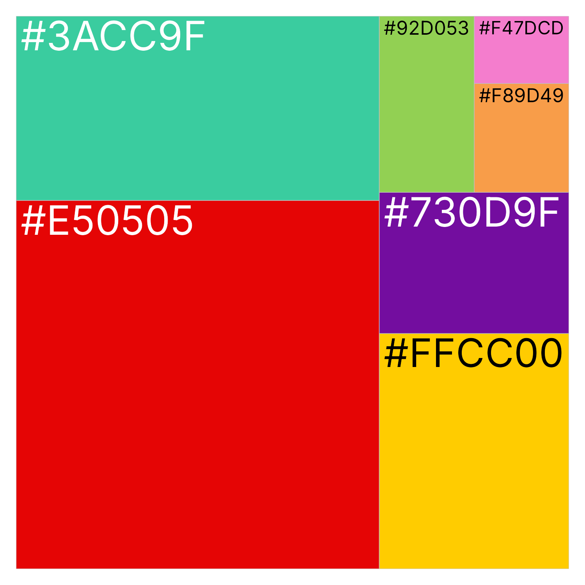
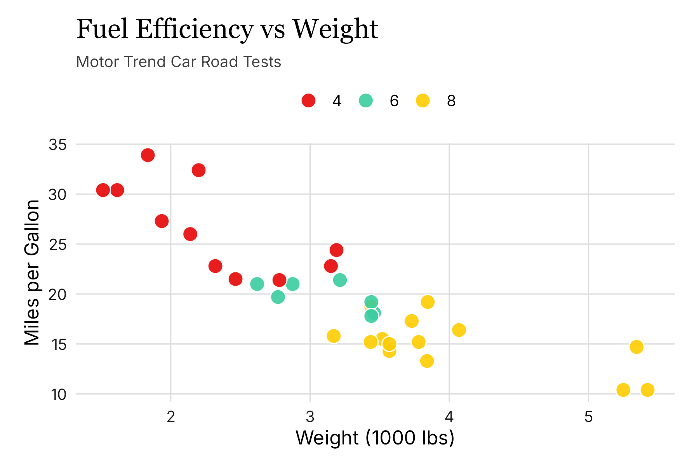

<!-- README.md is generated from README.Rmd. Please edit that file -->

# insperplot 

<!-- badges: start -->

[](https://github.com/inspercidades/insperplot/actions/workflows/R-CMD-check.yaml)
[](https://inspercidades.r-universe.dev)
[](https://lifecycle.r-lib.org/articles/stages.html#stable)
<!-- badges: end -->

**insperplot** extends ggplot2 with Insper's visual identity, providing
custom themes, color palettes, and specialized plotting functions for
academic and institutional use. Insper is a non-profit institution
dedicated to teaching and research.

## Installation

Install the latest release from the Insper Cidades
[r-universe](https://inspercidades.r-universe.dev), which ships
pre-built binaries for Windows, macOS, and Linux.

``` r
install.packages(
  "insperplot",
  repos = c(
    "https://inspercidades.r-universe.dev",
    "https://cloud.r-project.org"
  )
)
```

Alternatively, install the development version directly from GitHub.

``` r
# install.packages("remotes")
remotes::install_github("inspercidades/insperplot")
```

## Quick Start

`insperplot` is built upon Insper's brand colors.

<p align="center">


</p>

To use `insperplot` we recommend using `ggplot2`. The basic functions of
the package are `theme_insper()` and the `scale_*_insper_*()` functions.

``` r
library(insperplot)
library(ggplot2)
library(ragg)

# Create a basic plot with Insper theme
ggplot(mtcars, aes(x = wt, y = mpg, fill = factor(cyl))) +
  geom_point(color = "#ffffff", size = 4, shape = 21, alpha = 0.9) +
  scale_fill_insper_d(name = NULL) +
  theme_insper() +
  labs(
    title = "Fuel Efficiency vs Weight",
    subtitle = "Motor Trend Car Road Tests",
    x = "Weight (1000 lbs)",
    y = "Miles per Gallon"
  )
```

<p align="center">


</p>

To see all palettes, use `show_insper_palettes()`. To see a particular
palette, use `insper_palette()`.

``` r
# View the core Insper brand colors (prints a color swatch)
insper_palette("main")
```

## Fonts and Rendering

`insperplot` bundles the **Inter** font family (licensed under the SIL
Open Font License), the only free font in Insper's 2026 brand kit. It is
registered automatically when the package is loaded — no manual download
or setup required.

The default title font is **Georgia**, a system serif font pre-installed
on most operating systems and the documented substitute for Insper's
primary GT Ultra. If Georgia is unavailable, the theme falls back to the
system serif family.

For the best rendering quality, install the
[ragg](https://ragg.r-lib.org/) graphics device.

``` r
install.packages("ragg")
```

If you use **RStudio**, set the graphics backend to AGG: **Tools \>
Global Options \> General \> Graphics \> Backend \> AGG**. **Positron**
users can skip this step since it uses ragg by default.

## Documentation

For detailed documentation and examples, visit the [package
website](https://inspercidades.github.io/insperplot/).
